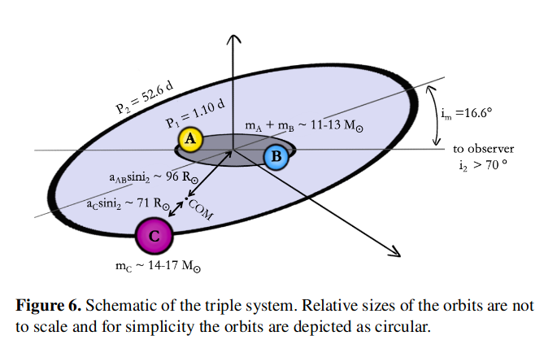

# Key Points of different sources in literature

<ins> General Triple Evolution </ins> 

Paper: [The evolution of hierarchical triple star-stystems](https://link.springer.com/article/10.1186/s40668-016-0019-0)

* Hierarchical triple means that the orbit of the tertiary ( $\alpha_{out}$ ) is much larger than that of the inner binary ( $\alpha_{in}$ ) around the center of mass of the system.

* To define a triple system at least 10 variables needed. The masses of the inner binary components $m_1, m_2$ and the mass of the outer star $m_3$. The semi-major axis $\alpha$ , the eccentricity $e$ and the argument of pericenter $g$ of both the inner and the outer orbit. The mutual inclination $i_{mut}$ between the two orbits and the longitudes of the ascending nodes $h$, which do not affect the intrinsic dynamical evolution.

* Ther are many stability criteria for systems (review here: [Stability criteria for hierarchical triple systems](https://link.springer.com/content/pdf/10.1007/s10569-007-9109-2.pdf)) , but the most commonly used is <ins> Mardling and Aarseth stability criterion </ins> (review here: [Tidal interactions in star cluster simulations](https://academic.oup.com/mnras/article/321/3/398/1096775)), which indicates that when the ratio of the semi-major axes of the outer and inner orbit decreases sufficiently, the system enters in to the instability regime (instability means the escape of one of the components). The criterion holds for arbitrary masses and inner and outer eccentricities, although only for coplanar prograde motion.

$$\frac{\alpha_{out}}{\alpha_{in}} < \frac{\alpha_{out}}{\alpha_{in}}\bigg\rvert_{crit}$$
 

* The orbital inner eccentricity $e_{in}$ and the mutual inclination $i_{mut}$ vary periodically if the Lidov-Kozai mechanism is active, where $e_{in}$ = max when $i_{mut}$ = min. The mechanism is active for triples with $i_{mut} \in [39.2\degree , 140.8\degree]$. If the outer orbit is eccentric or if the stars in the inner binary have unequal masses the eccentic Lidov-Kozai mechanism can occur, which allows for a flip in the inclination such that the inner orbit flips from prograde to retrograde or vice versa.

* Tides and GW are dissipative processes and act to circulize the orbit and shrink the orbital seperation.

* The combination of the Lidov-Kozai mechanism with tidal friction (LKCTF) can lead to an enhanced formation of close binaries or with GW emission to an enhanced rate of mergers and RLOF.

* In case of massive stars strong winds remove large amounts of mass and can widen the inner and outer orbits. Initially $\frac{\dot{\alpha_{in}}}{\alpha_{in}} < \frac{\dot{\alpha_{out}}}{\alpha_{out}}$, but the the effect of LKCTF can lead to a faster expansion of the outer orbit making the triple dynamically stable.

* RLOF in eccentric binaries (due to the Lidov-Kozai mechanism) differs from the simple picture of synchronization and circularisation before RLOF. In an eccentric orbit, the Roche lobe of a star at periastron may be significantly smaller than that in a binary that is circularized at the same distance. The modification of the Roche lobe affects the evolution of the mass transfer phase, e.g. the duration and the mass loss rate. SImualtions show that the mass transfer rate peaks just after the periastron and its evolution shows a Gaussian-like shape.

Paper: [The evolution of triples with a Roche lobe filling outer star](https://academic.oup.com/mnras/article/438/3/1909/966818)

<ins> System TIC 470710327 </ins> 

Paper: [Planet Hunters TESS IV: a massive, compact hierarchical triple star system TIC 470710327](https://academic.oup.com/mnras/article/511/4/4710/6540660?casa_token=YZNsKHONsZYAAAAA:67B9NEgTOIKOuIS7ILsO_6f2A0JULw7ZJ0xorQYhYujmC76c4u8F_Dq-_U6r-DFx5--0mJp66iYRZw)

* TIC 470710327 is a compact, hierarchical triple system consisting of one O- and two B-type stars. The system, which shows large ETV and RV variations, contains an inner $\sim 1.1 d$ eclipsing binary and a massive O9.5-B0.5V  non transiting tertiary orbiting a common centre of mass in $\sim 52 d$ orbit.

* The current configuration currently is dynamically stable $\frac{\alpha_{out}}{\alpha_{in}} > \frac{\alpha_{out}}{\alpha_{in}} \bigg\rvert_{crit}$  . Furthermore, the effect of Lidov-Kozai mechanism is unlikely to be significant for the system due to $i_{mut} = 16.8\degree$

* The octupule term is within the range of relevance for the dynamical evolution of the system. Hence, the eccentric Lidov-Kozai mechanism could possibly give rise to more extreme eccentricity cycles under the assumption that the mass ratio of the inner binary is less than unity (full radial-velocity characterisation of the inner components  would provide constraints in the time-scale and amplitude of these cycles)

* The observed mass ratio implies that the remainder of this system’s evolution will be driven by the evolution of the tertiary as this star will be the first to evolve off the MS. The tertiary star of $14-17 M_{\odot}$, is expected to fill its Roche lobe at an age of $\sim 13 Myr$, at which point it will start transferring mass towards the inner binary. The outcome of such process is a strictly hydrodynamical problem and depends on the nature of the mass transfer and the response of the inner binary.

* If the compactness of the inner binary is high enough a circumbinary disk may form. Such a situation favors evolution toward equal mass inner binary stars by causing preferential accretion to the lowest mass component. On the other hand, friction may cause the inner orbit to shrink if the mass transfer stream crosses it, which might result in a contact system and/or a merger.

Paper: [Mergers prompted by dynamics in compact, multiple-star systems: a stellar-reduction case for the massive triple TIC 470710327](https://academic.oup.com/mnrasl/article-abstract/515/1/L50/6620840)

* The proposed ‘2 + 2’ orbital configuration results in ZLK oscillations that prompt the merger of the more massive binary, leading to the triple configuration we detect today

* Slow rotation and high magnetic fields ( $\sim 1–10 kG$ ) in the tertiary star of TIC 470710327 would support the proposed scenario.

* This formation scenario predicts that highly inclined triple- and quadruple-star systems will experience stellar mergers and reduce to coplanar binary- and triple-star systems, respectively.

[def]: background_notes/images/TIC_470710327_representation.png
